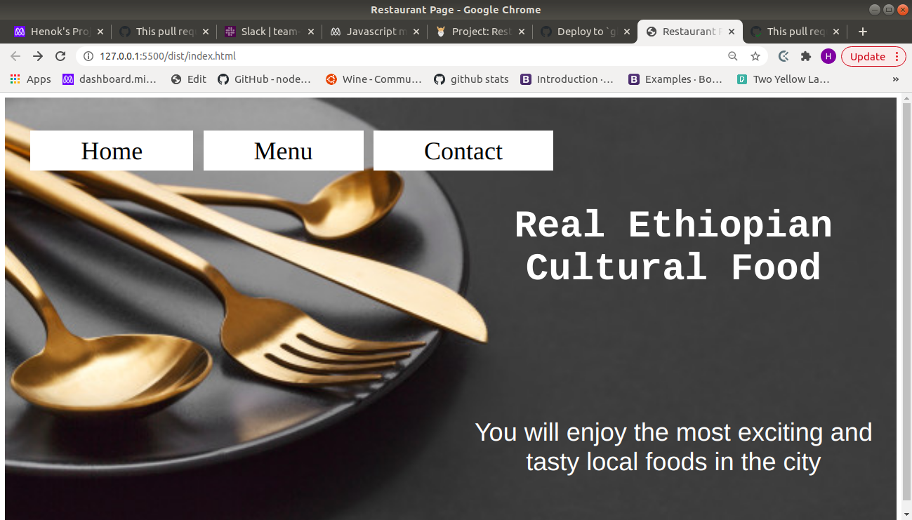
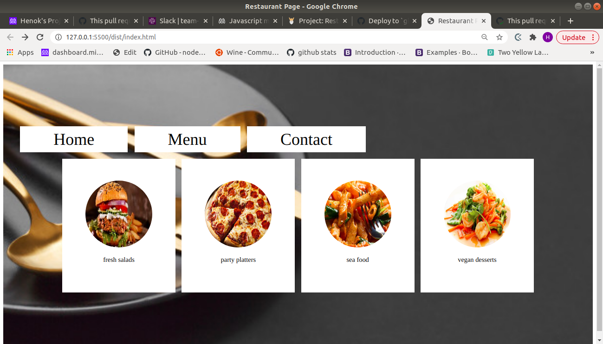
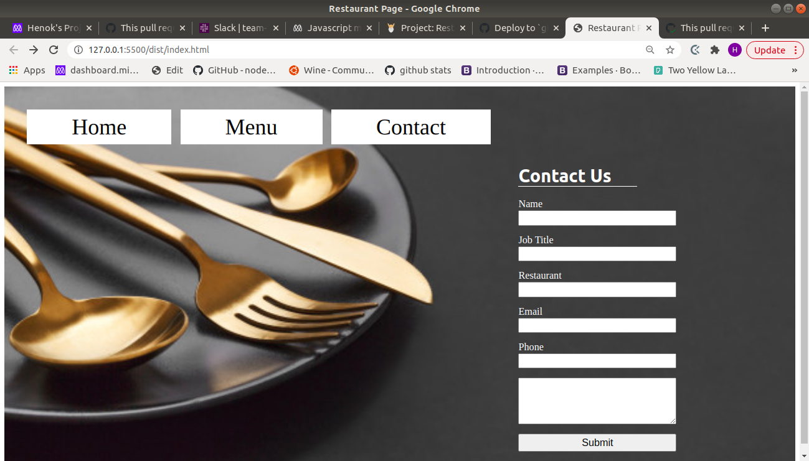

# Restaurant-page
This project is building a restaurant page web app to put into work modularized JS code and webpack. 
## Description 
This project is building a static restaurant website with home, menu, and contact pages. The project employs webpack and ES6 module concepts to organize and compile the dependencies and modules into a distribution package. 
The project has two directories namely 'src' and 'dist' other than the root directory.

### src
'src' is the directory where all the .js module files, .css files, resources, and index.js files are stored. 

### dist
'dist' is the directory where the webpack bundling output files (main.js and other loads) and index.html file are stored.  

### Webpack 
Webpack is used as a module bundler and is installed using an npm installer. A config file 'webpack.config.js' is used 
to define rules and plugins.
- Loaders installed and included in the mebpack.config.js file are: 'style-loader', 'css-loader', and 'file-loader';

### npm 
npm is used as the installer and package manager. terminal command 'npm init' is used to initialize npm locally and generate the package.json file.

### index.js
The 'index.js' file in the src directory is the main file that imports all the necessary module files and adds logic (functions) to display them in the required manner. 
All HTML content inside the body except the first outer div element "content", is generated by this DOM file.

### Demo 
- Home page 

- Menu Page

- Contact page

## Built With

- Javscript
- HTML/CSS
- Webpack 
- npm 
- package.json 

## Live Link
[Live Link](https://henatan99.github.io/Restaurant-page/)  

## Authors

👤 **Henok Mossissa**

- GitHub: [@henatan99](https://github.com/henatan99)
- Twitter: [@henatan99](https://twitter.com/henatan99)
- LinkedIn: [Henok Mossissa](https://www.linkedin.com/in/henok-mekonnen-2a251613/)

## :handshake: Contributing

Contributions, issues, and feature requests are welcome!

## Show your support

Give a :star:️ if you like this project!

## Acknowledgment 

## :memo: License

This project is [MIT](./LICENSE) licensed.
